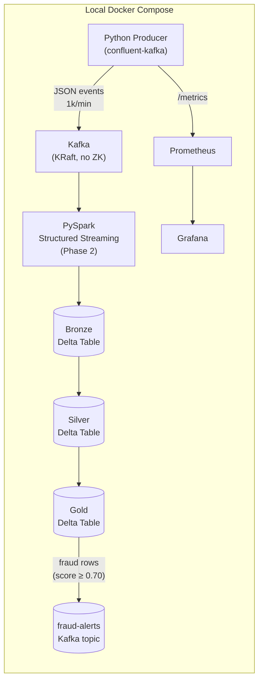

# FraudFlow

Real-time payments fraud detection pipeline, a data engineering portfolio project.

## Architecture



**Stack:** Kafka (KRaft), PySpark Structured Streaming, Delta Lake (bronze/silver/gold medallion), Prometheus, Grafana

---

## Quickstart

### Prerequisites
- Docker Desktop ≥ 4.x with Compose v2
- `kcat` (optional, for consuming events from the host): `brew install kcat`

### 1. Start the infrastructure

```bash
docker compose up -d
```

This starts Kafka, Prometheus, and Grafana. The producer is excluded by default.

```bash
# Verify Kafka is healthy (~30s after first boot)
docker compose exec kafka kafka-topics.sh --bootstrap-server localhost:9092 --list
```

### 2. Start the producer

```bash
docker compose --profile producer up -d producer
docker compose logs -f producer
```

You should see: `Publishing to topic 'transactions'...`

### 3. Verify events are flowing

```bash
# From the host (kcat):
kcat -b localhost:9094 -t transactions -C -o beginning | head -5

# Or via Docker:
docker compose exec kafka kafka-console-consumer.sh \
  --bootstrap-server localhost:9092 \
  --topic transactions \
  --from-beginning \
  --max-messages 5
```

Each event looks like:
```json
{
  "transaction_id": "3f7a...",
  "card_id": "CARD-0042",
  "amount": 47.83,
  "merchant_id": "MERCH-0117",
  "merchant_category": "grocery",
  "lat": 40.71,
  "lon": -74.01,
  "timestamp": "2024-01-15T14:23:45Z",
  "country": "US",
  "is_fraud": false,
  "fraud_type": null
}
```

### 4. Monitoring

| Service | URL | Credentials |
|---|---|---|
| Grafana | http://localhost:3000 | admin / fraudflow |
| Prometheus | http://localhost:9090 | - |
| Producer metrics | http://localhost:8000/metrics | - |

Prometheus targets page: http://localhost:9090/targets, `producer:8000` should show **UP**.

### 5. Tune the producer

Override via environment variables in `.env` or pass directly:

```bash
EVENTS_PER_MINUTE=5000 FRAUD_RATE=0.02 docker compose --profile producer up producer
```

| Variable | Default | Range |
|---|---|---|
| `EVENTS_PER_MINUTE` | 1000 | 1 - 50000 |
| `FRAUD_RATE` | 0.015 | 0.0 - 0.5 |
| `NUM_CARDS` | 500 | - |
| `NUM_MERCHANTS` | 200 | - |

### 6. Stop everything

```bash
docker compose --profile producer down
```

---

## Fraud Patterns

The producer injects three fraud patterns at the configured `FRAUD_RATE` (~1.5% by default):

| Pattern | `fraud_type` | Signal |
|---|---|---|
| Amount spike | `amount_spike` | A card that normally spends $10-$80 submits a $500-$3000 transaction |
| Velocity burst | `velocity_burst` | Same card fires 8-15 transactions in a 60-second window |
| Impossible travel | `impossible_travel` | Same card used >2,000 km apart within 5 minutes |

Each event carries `is_fraud: true/false` and `fraud_type: <string or null>` as ground-truth labels for downstream ML.

## Kafka Alerting

When the gold job scores a transaction above 0.70, it publishes the event to the `fraud-alerts` Kafka topic. Any downstream consumer (notifications service, case management tool, dashboard) subscribes independently.

```bash
# Watch fraud alerts in real time
docker compose exec kafka /opt/kafka/bin/kafka-console-consumer.sh \
  --bootstrap-server localhost:9092 --topic fraud-alerts
```

---

## Project Structure

```
FraudFlow/
├── docker-compose.yml          # Kafka (KRaft), Prometheus, Grafana, producer
├── .env                        # Default env vars (committed, no secrets)
├── producer/
│   ├── producer.py             # Main event loop + Prometheus metrics
│   ├── transaction_generator.py# Card/merchant state, event schema
│   ├── fraud_patterns.py       # AmountSpike, VelocityBurst, ImpossibleTravel
│   ├── config.py               # All env var parsing in one place
│   ├── Dockerfile
│   └── requirements.txt
├── monitoring/
│   ├── prometheus.yml
│   └── grafana/provisioning/datasources/prometheus.yml
├── streaming/                  # PySpark Structured Streaming jobs
│   ├── spark_utils.py          # SparkSession factory (local + Databricks portable)
│   ├── Dockerfile
│   └── jobs/
│       ├── bronze_ingestion.py # Kafka → Delta (raw, immutable)
│       ├── silver_cleansing.py # Dedup (watermark) + validation
│       └── gold_fraud_signals.py # Velocity, z-score, geo signals → fraud-alerts topic
└── databricks/                 # Databricks Free Edition notebooks
    ├── 00_setup.py             # Shared paths (auto-detects Unity Catalog)
    ├── 01_data_generator.py    # Replaces Kafka on CE, generates synthetic data
    ├── 02_silver.py            # Same logic as streaming/silver, availableNow trigger
    ├── 03_gold.py              # Same logic as streaming/gold, availableNow trigger
    ├── 04_explore.py           # Portfolio queries: fraud breakdown, z-scores, lineage
    └── DATABRICKS_SETUP.md
```

---

## Measured Results (Databricks Free Edition, 50k events)

| Metric | Value |
|---|---|
| Dataset size | 50,000 transactions |
| Realized fraud rate | 1.96% (979 / 50,000) |
| High-confidence alerts (score ≥ 0.70) | 261 (0.52%) |
| Silver dedup drop rate | 0% (no duplicates in generated data) |
| Amount spike avg transaction | $1,834 vs $47 normal (39× spike) |
| Amount spike max transaction | $2,995.61 |
| Velocity burst events detected | 598 |
| Impossible travel events detected | 129 |
| Z-score > 3 fraud events | 248 (all amount spikes) |

**Fraud by country** (Top 3 by rate): CA 2.59% · GB 2.49% · FR 2.45% · DE 2.43%

**Local Docker producer** (configurable via `.env`): tested at 1k-50k events/min

---

## Roadmap

- [x] Kafka producer: 1k-50k events/min, three fraud patterns, Prometheus metrics
- [x] PySpark Structured Streaming: bronze/silver/gold Delta medallion (local Docker)
- [x] Grafana dashboard: events/min, fraud rate, throughput, processing lag
- [x] Kafka alerting: high-confidence fraud events published to `fraud-alerts` topic
- [x] Databricks Free Edition: full pipeline on serverless compute, Unity Catalog volumes
